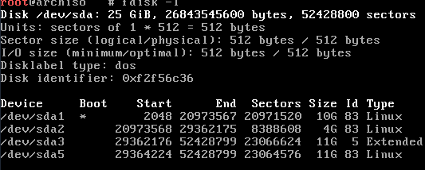
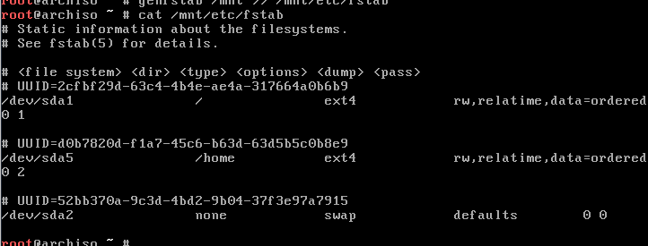

# Base Install

### Updating and setting mirror sites from base install

```
 $ pacman -Syu  # To force an update
 $ pacman -Syy  # to refresh mirror lists
```

### 1. Create disk partitions 
1. Run cfdisk and choose option dos
2. Create three partitions two primary types and one extended for home
   - Root partition of type primary and with "bootable" option
   - Swap partition of type primary - must be at  least twice the size of memory
   - Home partition of type extended for home directory
```
 $ fdisk -l  # should show two partitions, one for the current disk size and another loopback before creating partitions
``` 
```fdisk -l``` output should show the following after partitions have been created
 

### 2. Format each partitions

The "root" and the "home" partitions should be formatted as ext4 while the swap partition as swp.

```
$ mkfs.ext4 /dev/sda1 #root partition
$ mkfs.ext4 /dev/sda5 #home partition
```
Now format and enable the swap partition
```
 $ mkswap /dev/sda2  # to format
 $ swapon /dev/sda2  #to turn it on
```
### 3. Mount the new created partitions
Mount root partition first
```
 $ mount /dev/sda1 /mnt # mounts the partition to the mount folder
```
Create a home folder under /mnt to mount the home folder to
```
 $ mkdir /mnt/home
 $ mount /dev/sda5 /mnt/home
```

### 4. Now install Arch Linux base system on /mnt
Use the pacstrap script to install the base system which is only 800M and for other development tools use base-devel
```
 $ pacstrap /mnt base base-devel
```
Use the [ArchLinux package search tool](https://www.archlinux.org/packages/) for all other available packages

### 5. Configure the system

  - Generate an fstab file and check the resulting file in /mnt/etc/fstab
  ```
   $ genfstab /mnt >> /mnt/etc/fstab # to create it
   $ cat /mnt/etc/fstab # to view the newly created file
  ```
  The contents of the fstab file should look like the following screenshot.
  
  
  - Change root into the new system
  ```
   $ arch-chroot /mnt /bin/bash #enable bash under the system mnt folder
  ```
  - Set locale and timezones
  
  Uncomment en_US.UTF* and other needed localizations in /etc/locale.gen and generate them with
  ```
   $ locale-gen 
  ```
  - Set timezone
     - Display list of available timezones ```ls /usr/share/zoneinfo```
     - select the relevant timezone and create a link to its directory
     ```
      $  ln -sf /usr/share/zoneinfo/Region/City /etc/localtime
     ```
  - Set hardware clock ```$ hwclock --systohc --utc```
  - Create the hostnames file
  Create the /etc/hostname file and enter the hostname and then enable dhcpcd ```$ systemctl enable dhcpcd``` 
  - root password - run the passwd tool to create new root passwords
  - Boot loader - create and install a grub boot loader. Here is a sample os-graber boot loader. See the category [Boot Loaders](https://wiki.archlinux.org/index.php/Category:Boot_loaders)
  ```
   $ pacman -S grub os-prober
   $ grub-install /dev/sda
   $ grub-mkconfig -o /boot/grub/grub.cfg
 ```
 ### 6. Unmount, exit and rboot the system
 ```
  exit, umount /mnt, umount /mnt/home, reboot
 ```
 Login with the new root password

### 7. Create users with sudo privlidges
```
 $ pacman -Syu # get recent updates
 $ pacman -Syy # synchronize mirror sites
 ```
 Create user smuser with the following provlidges
 ```
  $ useradd -m -g users -G video,audio,optical,network,storage,wheel -s /bin/bash smuser
  $ passwd smuser  "set the password for the new user
 ```
 Run visudo and enable wheel, select ECS, :x to save and exit. Re-login as the new user and check to see if the user can install a new package.
 
### Errors
1. Adjust the size of root partition on Live Arch Linux
```
error: partition / too full: 63256 blocks needed, 61450 blocks free
error: not enough free disk space
error: failed to commit transaction (not enough free disk space) 
Errors occurred: no packages were upgraded.
```
press e or hit tab key to edit the kernel parameters. Go to the end of the line that says “…. linux=… initrd=….” something like that and append cow_spacesize=1G at the end to get 1GB size root partition or whatever space left from RAM.
